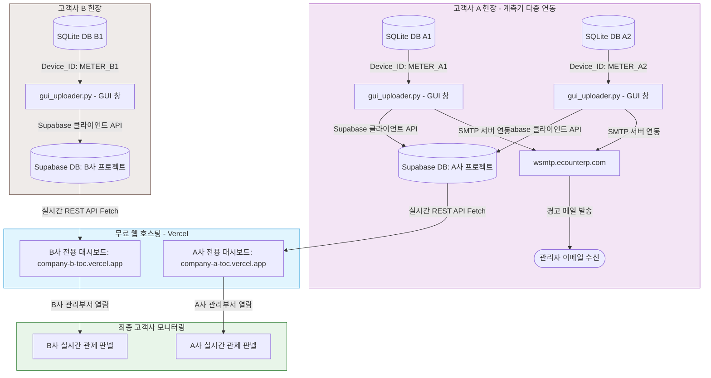

# 💧 TOC B2B 멀티테넌시 계측 모니터링 시스템 구축 작업계획서 (System Architecture)

본 문서는 여러 현장의 다중 계측기 데이터를 클라우드 서버 구독 비용이나 백엔드 서버 개발 없이 완전 무료로 동기화하고, 여러 고객사(회사)별로 데이터를 물리적으로 격리하여 고품격 대시보드를 독립 공급하기 위한 B2B 멀티테넌시 구조 정의서입니다.

---

## 1. B2B 멀티테넌시 시스템 구성도 (System Architecture)

### 핵심 B2B 멀티테넌시 및 알림 설계 원칙
1. **장비 식별자 (`Device_ID`) 매립 설계**:
   * 현장 기기마다 고유한 기기 ID(예: `DEVICE_01`, `DEVICE_02`)를 부여합니다.
   * 로컬 GUI 업로더 프로그램의 입력창을 통해 이 장비 ID를 관리하고 저장할 수 있습니다.
   * 데이터 전송 시 `Device_ID`를 매립하여 Supabase에 적재하므로, 하나의 데이터베이스 안에서도 어떤 기기가 측정한 수치인지 완벽하게 논리 구분 및 필터 조회가 가능합니다.
2. **고객사별 독립 클라우드 DB 격리 (물리적 테넌시)**:
   * 고객사별로 **Supabase 프로젝트를 개별 생성**하여 물리적으로 데이터를 완전 격리합니다.
   * GUI 업로더 프로그램에 각 고객사 프로젝트의 Supabase URL 및 API Key를 설정하여 타사 데이터가 섞이는 일을 원천 차단합니다.
3. **3단계 경고 시각화 및 원격 설정 연동**:
   * 대시보드상에서 계측 수치를 **평시(흰색) · 주의(노랑) · 경고(빨강)** 3단계로 구분하여 표시합니다.
   * 주의/경고 임계치 및 수신자 이메일 주소록은 웹 대시보드 설정 창에서 변경할 수 있으며, 기존 DB 스키마 변경 없이 `toc_alert_high` 컬럼의 JSON 구조에 포장하여 Supabase에 동기화합니다.
4. **로컬 SMTP 경고 메일 발송 및 비동기 테스트**:
   * 계측기 PC의 파이썬 업로더가 데이터를 업로드할 때 경고 수치 초과를 감지하면 로컬 SMTP 서버(`wsmtp.ecounterp.com`)를 통해 경고 메일을 발송합니다. (채널별 1시간 발송 제한 쿨다운 적용)
   * 브라우저 보안을 위해 웹 대시보드에서 "테스트 메일 발송"을 누르면 Supabase에 `trigger_test_email: true` 신호를 보냅니다. 이를 파이썬 업로더가 10초 주기로 감지하여 이메일을 발송하고 플래그를 초기화합니다.

---

## 2. 도입 도구 및 무료 서비스

| 분류 | 선정된 B2B 도구 / 서비스 | B2B 선정 강점 | 비용 |
| :--- | :--- | :--- | :--- |
| **GUI & 업로더** | **Python (Tkinter + Threading)** | SQLite 내장, 기기 식별자(`Device_ID`) 입력 장치 장착, 비동기 스레드 전송. | **무료** |
| **클라우드 데이터베이스** | **Supabase (PostgreSQL)** | 개발자 친화적 REST API 제공, 행 레벨 보안(RLS) 및 실시간 동기화 지원. | **무료 티어** |
| **이메일 알림** | **SMTP (ecounterp)** | 외부 메일 서버를 통한 경고 알람 메일 즉시 발송. | **무료** |
| **대시보드 웹앱** | **React + Vite (JavaScript)** | 컴포넌트 렌더링, Recharts 실시간 기기 필터 렌더링. | **무료** |
| **차트 시각화** | **Recharts** | 실시간 다중 계측기 토글 필터 및 시계열 추이 차트. | **무료** |
| **웹앱 호스팅** | **Vercel** | 고객사별 독립 대시보드 정적 웹사이트 무제한 무료 생성 및 고유 주소 배포. | **무료** |
