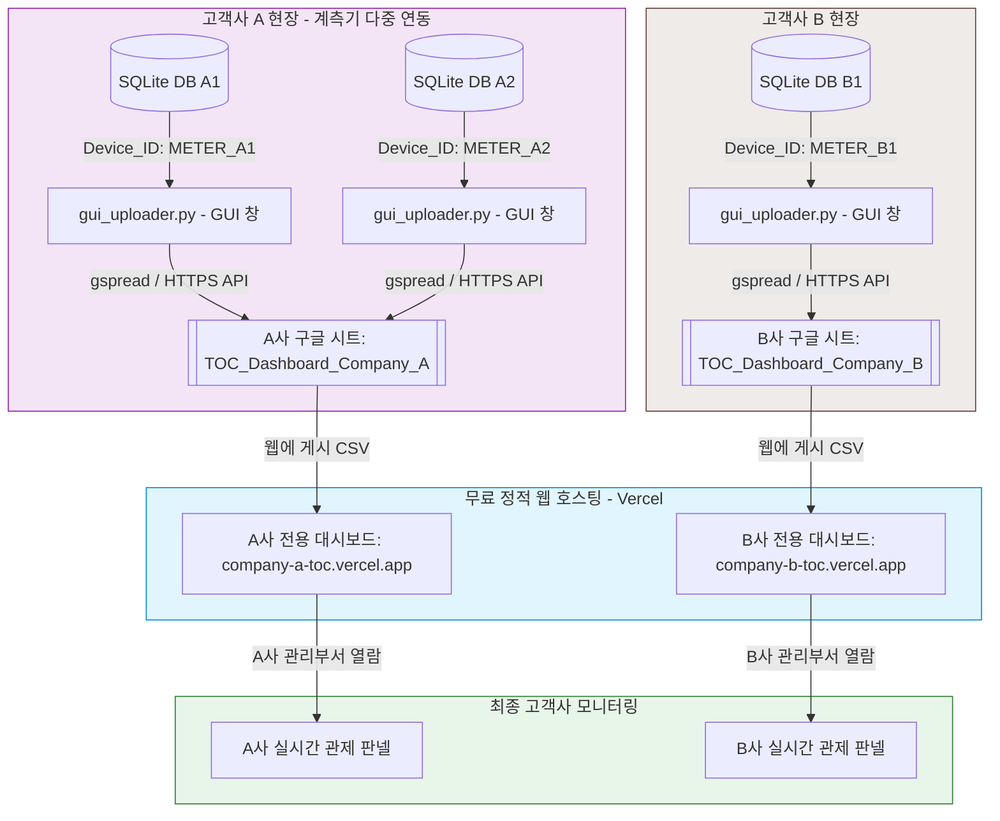

# 💧 TOC B2B 멀티테넌시 계측 모니터링 시스템 구축 작업계획서 (System Architecture)

본 문서는 여러 현장의 다중 계측기 데이터를 클라우드 서버 구독 비용이나 백엔드 서버 개발 없이 완전 무료로 동기화하고, 여러 고객사(회사)별로 데이터를 물리적으로 격리하여 고품격 대시보드를 독립 공급하기 위한 B2B 멀티테넌시 구조 정의서입니다.

---

## 1. B2B 멀티테넌시 시스템 구성도 (System Architecture)

### 핵심 B2B 멀티테넌시 설계 원칙
1. **장비 식별자 (`Device_ID`) 매립 설계**:
   * 현장 기기마다 고유한 기기 ID(예: `DEVICE_01`, `DEVICE_02`)를 부여합니다.
   * 로컬 GUI 업로더 프로그램의 입력창을 통해 이 장비 ID를 관리하고 저장할 수 있습니다.
   * 데이터 전송 시 첫 행 헤더 컬럼 구조의 두 번째 위치에 `Device_ID`를 강제 매립하여 전송하므로, 하나의 구글 시트 안에서도 어떤 기기가 측정한 수치인지 완벽하게 논리 구분 및 결합 분석이 가능합니다.
2. **고객사별 독립 클라우드 DB 격리 (물리적 테넌시)**:
   * 여러 고객사의 민감한 계측 데이터가 단일 DB에 혼재하여 섞이는 일을 원천 차단하기 위해, 고객사별로 **구글 스프레드시트 자체를 별도 개설**합니다.
   * GUI 업로더 프로그램의 스프레드시트 타겟 이름(예: `TOC_Dashboard_Company_A`)을 다르게 지정하는 것만으로 완벽한 데이터 물리 격리가 완성됩니다.
3. **고객사별 독립 대시보드 무서버 배포**:
   * React 웹 대시보드 정적 빌드 결과물을 무료 정적 호스팅(Vercel, Netlify)에 고객사별로 각각 독립 배포(무제한 무료 생성)합니다. (예: `company-a.vercel.app`, `company-b.vercel.app`)
   * 각 배포본 소스코드 내부에는 해당 고객사의 구글 시트 웹 게시 CSV 스트리밍 주소만 하드코딩 맵핑되므로, 타사 데이터가 노출될 위험이 원천적으로 차단(0%)됩니다.

---

## 2. 도입 도구 및 무료 서비스

| 분류 | 선정된 B2B 도구 / 서비스 | B2B 선정 강점 | 비용 |
| :--- | :--- | :--- | :--- |
| **GUI & 업로더** | **Python (Tkinter + Threading)** | SQLite 내장, 기기 식별자(`Device_ID`) 입력 장치 장착, 비동기 스레드 전송. | **무료** |
| **API 커넥터** | **gspread, oauth2client** | 구글 시트 API를 파이썬 객체로 안정적으로 밀어주는 초경량 라이브러리. | **무료** |
| **클라우드 데이터베이스** | **Google Sheets** | 고객사별 구글 시트 무한 개설 무료, 데이터 수동 엑셀 제어 호환성 최고. | **무료** |
| **대시보드 웹앱** | **React + Vite (JavaScript)** | 컴포넌트 렌더링, 500개 기기가 몰려도 렉 없는 Recharts 다중 기기 필터 렌더링. | **무료** |
| **차트 시각화** | **Recharts** | 실시간 다중 계측기 토글 필터, 라인 차트, 채널 부하 이중 막대 차트. | **무료** |
| **웹앱 호스팅** | **Vercel / GitHub Pages** | 고객사별 독립 대시보드 정적 웹사이트 무제한 무료 생성 및 고유 주소 배포. | **무료** |
