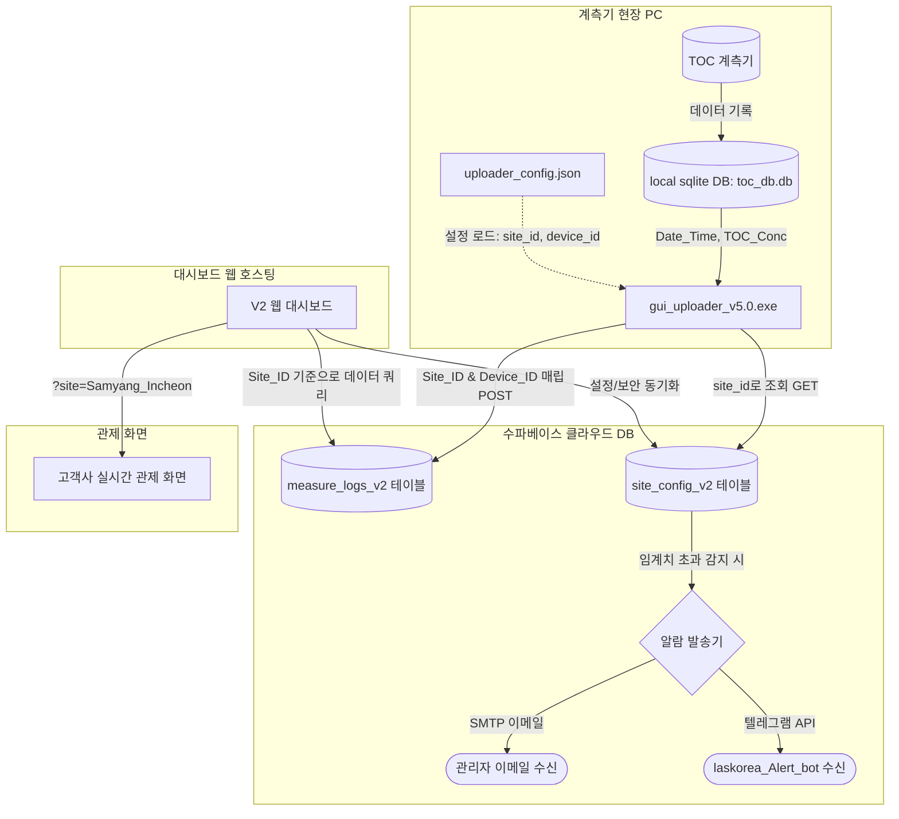

# 💧 TOC850 B2B 모니터링 시스템 통합 명세서 및 운용 가이드 (V2)

본 문서는 **TOC(총유기탄소) 계측 데이터 동기화 및 실시간 관제 대시보드 시스템(V2)**의 전체 구조, 데이터베이스 설계, 환경 설정, 텔레그램 알람 연동 및 현장 운영 가이드라인을 집대성한 통합 명세서입니다.

---

## 1. 시스템 아키텍처 및 설계 원칙

v5.0 (V2 아키텍처)의 핵심 설계 철학은 **"물리 장치(Device)와 논리 지점(Site)의 역할 분리"**를 통한 데이터 영속성 확보입니다.



### 💡 핵심 설계 강점
1. **데이터 연속성 보장**:
   * 대시보드 차트는 PC의 고유 장치명이 아닌, 설정된 지점 코드(`Site_ID`)를 기준으로 데이터를 조회합니다.
   * 따라서 현장의 PC가 고장 나서 새 PC로 교체되더라도, 새 PC의 설정 파일에 동일한 `site_id`만 적어주면 과거 데이터와 신규 데이터가 하나의 꺾은선 차트 타임라인에 끊김 없이 매끄럽게 연결됩니다.
2. **Zero-Touch Onboarding (자동 등록)**:
   * 장비 세팅 후 프로그램을 최초 기동하면, Supabase 설정 테이블(`site_config_v2`)에 해당 지점 정보가 존재하지 않을 시 프로그램이 기본값을 채워 자동으로 행(Row)을 추가합니다. 관리자가 DB를 수동으로 만질 필요가 없습니다.

---

## 2. Supabase V2 데이터베이스 스키마 (SQL DDL)

웹 대시보드와 업로더 프로그램이 바라보는 PostgreSQL 테이블 구조 정의입니다.

```sql
-- 1. 지점 설정 테이블 (site_config_v2)
CREATE TABLE public.site_config_v2 (
    site_id text NOT NULL PRIMARY KEY,            -- 지점 고유 코드 (예: Samyang_Incheon)
    site_name text NOT NULL,                      -- 지점 한글명 (예: 삼양사 인천공장)
    passcode text NOT NULL DEFAULT '850',         -- 대시보드 설정 진입 패스코드
    alert_emails text NULL,                       -- 경보 이메일 수신 목록 (쉼표 구분)
    telegram_chat_ids text NULL,                  -- 경보 텔레그램 수신 Chat ID (쉼표 구분)
    toc_alert_high jsonb NULL,                    -- 채널별 경보 임계값 및 테스트 트리거 저장 JSON
    use_single_table boolean NOT NULL DEFAULT true, -- 단일 테이블 가동 플래그
    created_at timestamp with time zone NOT NULL DEFAULT now()
);

-- 2. 통합 계측 로그 테이블 (measure_logs_v2)
CREATE TABLE public.measure_logs_v2 (
    id bigint GENERATED BY DEFAULT AS IDENTITY PRIMARY KEY,
    "Date_Time" timestamp without time zone NOT NULL,  -- 계측 시간
    "Site_ID" text NOT NULL,                          -- 귀속된 지점 고유 코드
    "Device_ID" text NOT NULL,                        -- 실제 업로드한 PC 호스트네임
    "Channel" smallint NOT NULL,                      -- 채널 번호 (1, 2, 3 등)
    "Channel_Name" text NOT NULL,                    -- 채널 이름 (유입수, 방류수 등)
    "TOC_Conc" numeric(10, 4) NOT NULL,              -- TOC 측정 농도 (ppm)
    "DilutionFactor" numeric(6, 2) NOT NULL DEFAULT 1.0,
    "MSIG" numeric(10, 4) NULL,
    "SLOP" numeric(10, 4) NULL,
    "ICPT" numeric(10, 4) NULL,
    "FACT" numeric(10, 4) NULL,
    "OFST" numeric(10, 4) NULL,
    "Add_note" text NULL,                             -- 비고 (예: [MOCK TEST DATA])
    created_at timestamp with time zone NOT NULL DEFAULT now()
);

-- 인덱스 설정 (대용량 시계열 검색 속도 최적화)
CREATE INDEX idx_measure_logs_v2_site_id ON public.measure_logs_v2("Site_ID");
CREATE INDEX idx_measure_logs_v2_date_time ON public.measure_logs_v2("Date_Time");
```

---

## 3. 계측기 PC uploader_config.json 설정 명세

현장 PC의 프로그램 폴더 내에 저장될 설정 구성 방식입니다.

```json
{
    "db_path": "d:\\antigravity\\db_upload_and_dashboard\\toc_db.db",
    "google_sheet_name": "TOC_Measure_Dashboard",
    "supabase_table": "measure_logs_v2",
    "site_id": "Samyang_Incheon",
    "device_id": "auto",
    "interval_seconds": 900,
    "last_datetime": "",
    "last_query": "SELECT * FROM Measure_Result_With_Channel_Name ORDER BY Date_Time ASC",
    "is_paused": false,
    "is_mock": false,
    "supabase_url": "https://abfjmqnurtjfbflquqsp.supabase.co/rest/v1/",
    "supabase_key": "eyJhbGciOiJIUzI1NiI...",
    "smtp_server": "wsmtp.ecounterp.com",
    "smtp_port": 587,
    "smtp_user": "toc850@las-korea.com",
    "smtp_password": "your_smtp_password",
    "smtp_use_tls": true,
    "alert_type": "telegram",
    "telegram_bot_token": "<TELEGRAM_BOT_TOKEN>"
}
```

### 📋 주요 필드 상세
* **`supabase_table`**: 신규 규격인 `"measure_logs_v2"`를 기입합니다.
* **`site_id`**: 
  * 출고 후 현장 설치 시에는 해당 지점 코드(예: `"Samyang_Incheon"`)를 적습니다.
  * 공장 테스트 단계이거나 미결정 시에는 `"auto"`로 둡니다. (자동으로 PC 호스트네임이 지점 코드가 됩니다.)
* **`device_id`**: 항상 `"auto"`로 설정합니다. 기동 시 실제 컴퓨터 이름을 자동 수집하여 데이터베이스의 `Device_ID` 로그에 채워 넣습니다.
* **`alert_type`**: 알림 수단 분기 설정입니다. `"email"` 또는 `"telegram"`을 기입합니다.
* **`telegram_bot_token`**: 텔레그램 봇 알림용 토큰입니다. 발급받으신 **`<TELEGRAM_BOT_TOKEN>`**을 기입하여 연동합니다.

---

## 4. 🤖 텔레그램 봇 연동 및 Chat ID 확인 가이드

현재 `laskorea_Alert_bot`이 생성 완료된 상태입니다. 알림을 수신하기 위해 수신자(또는 단톡방)의 **Chat ID**를 얻는 방법입니다.

### 🔍 1단계: 봇 활성화 (수신자 행동)
1. 알림을 받고 싶은 수신자는 텔레그램 앱에서 **`laskorea_Alert_bot`**을 검색하여 대화창에 진입합니다.
2. 하단의 **`시작` (또는 `/start` 입력)** 버튼을 클릭하여 봇을 활성화시킵니다. *(이 과정이 선행되지 않으면 보안 정책상 봇이 메시지를 보낼 수 없습니다.)*

### 🔑 2단계: 수신자 Chat ID 조회 및 연동
1. 사용자가 봇에 메시지를 1회 이상 보냈다면, 웹 브라우저 주소창에 아래 주소를 복사해 입력하고 엔터를 누릅니다:
   * 👉 `https://api.telegram.org/bot<TELEGRAM_BOT_TOKEN>/getUpdates`
2. 출력되는 JSON 내용에서 `"chat"` 오브젝트 내부의 **`"id"` 값(9자리 또는 10자리 숫자)**을 확인합니다:
   ```json
   "message": {
     "chat": {
       "id": 123456789,
       "first_name": "홍길동",
       "type": "private"
     },
     "text": "/start"
   }
   ```
3. 확인된 **숫자 ID(`123456789`)**를 웹 대시보드의 설정 창 **"알림 수신 텔레그램 Chat ID"** 필드에 적고 저장(💾)을 누르면 모든 연결이 끝납니다. (여러 명인 경우 쉼표로 연결: `123456789, 987654321`)

---

## 5. 실무 운영 및 문제 조치 시나리오

### Scenario A. 장비 출고 전 사전 테스트
1. 공장에서 조립된 PC의 `uploader_config.json`을 열어 `"site_id": "auto"`로 지정하고 프로그램을 실행합니다.
2. PC 호스트명(예: `TOC-PC-01`) 기준으로 `site_config_v2`에 기본 설정이 자동 생성되며 데이터 업로드가 시작됩니다.
3. 웹 대시보드 `https://dashboard-ochre-two-35.vercel.app/?site=TOC-PC-01` 주소로 테스트 가동 상태를 원격 관제합니다.

### Scenario B. 납품 및 지점 전환
1. 현장에 장비가 설치되면 `uploader_config.json`의 `site_id` 값을 `"Samyang_Incheon"`과 같이 한글과 매칭 가능한 영문 코드로 변경해 줍니다.
2. 프로그램을 가동하면 Supabase에 `Samyang_Incheon` 설정이 자동 추가됩니다.
3. 웹 대시보드 설정 창에 들어가 한글 지점명(`삼양사 인천공장`), 수신 메일 및 텔레그램 Chat ID를 최종 입력하고 저장합니다.
4. 고객에게는 대시보드 주소 `https://dashboard-ochre-two-35.vercel.app/?site=삼양사_인천`을 제공합니다.

### Scenario C. PC 고장으로 새 PC 교체 시 (가장 중요)
1. 새 컴퓨터(`TOC-PC-02`)에 업로더 v5.0 패키지를 복사합니다.
2. 설정 파일(`uploader_config.json`)을 열어 기존과 동일하게 `"site_id": "Samyang_Incheon"`을 적어줍니다.
3. 프로그램을 실행하면, 새 PC는 자동으로 `Site_ID = 'Samyang_Incheon'`, `Device_ID = 'TOC-PC-02'` 정보로 데이터를 전송하기 시작합니다.
4. **결과**: 고객이 보고 있는 대시보드 주소(`?site=삼양사_인천`)에서는 아무런 화면 수정이나 도메인 변경 없이 기존 `TOC-PC-01` 시기의 데이터와 새로 들어온 `TOC-PC-02` 데이터가 하나의 그래프로 자연스럽게 연결되어 보여집니다.
